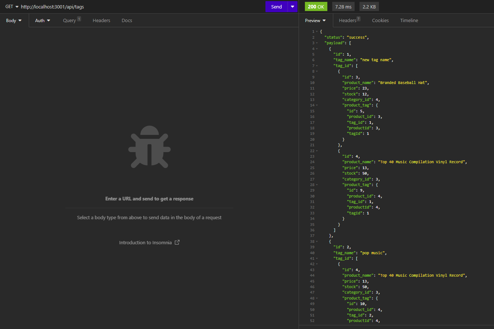

# Module 13 Challenge - E-Commerce Back End

## Description of Work
Created an E-Commerce Back End app using JS and npm: dotenv, express, mysql2, and sequelize.

## Final Screenshot

## Links
[GitHub](https://github.com/bpavlis/ecommerce-back-end)

[GitHub Pages](https://bpavlis.github.io/ecommerce-back-end/)

[Working Video](https://drive.google.com/file/d/1Ai-Uc3ISj-f5vx2yZafAFDIs_4XO-flN/view)
